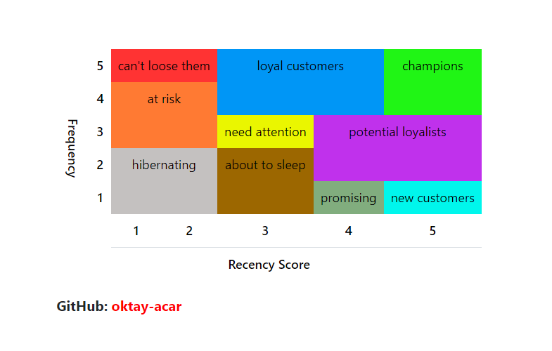

# Customer Segmentation with RFM *(Recency, Frequency, Monetary)* Analysis using [FLO](https://www.flo.com.tr/)'s Dataset

**Business Problem**

**FLO**, an online shoe store, wants to segment its customers and determine marketing strategies according to these segments. To this end, the behaviors of the customers will be defined and groups will be formed according to the clusters in these behaviors.

**Predictive Segments**

**Dataset Story**

The dataset consists of the information obtained from the past shopping behaviors of customers who made their last purchases from **FLO** as OmniChannel *(both online and offline shopper)* in 2020-2021.

**Variables**
- **master_id:** Customer ID
- **order_channel:** Shopping platform *(Android, ios, Desktop, Mobile, Offline)*
- **last_order_channel:** The channel where the most recent purchase was made
- **first_order_date:** Customer's first order date
- **last_order_date:** Customer's last order date
- **last_order_date_online:** Customer's last offline order date
- **last_order_date_offline:** Customer's last online order date
- **order_num_total_ever_online:** The total number of orders made by the customer online
- **order_num_total_ever_offline:** The total number of orders made by the customer offline
- **customer_value_total_ever_offline:** The total price paid by the customer for offline orders
- **customer_value_total_ever_online:** The total price paid by the customer for online orders
- **interested_in_categories_12:** List of categories the customer has shopped in the last 12 months

---

## Requirements
~~~python
pandas==1.5.1
~~~

---

## Author
[Oktay Acar](https://github.com/oktay-acar)